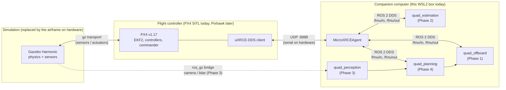

# quad-autonomy-sim

A simulated autonomous quadrotor built on the real flight stack: **PX4 Autopilot**
firmware in software-in-the-loop (SITL), **Gazebo Harmonic** for physics and
sensors, and **ROS 2 Humble** for the autonomy software. The custom estimation,
planning and control nodes are written in C++20.

There's no hardware involved, but the boundaries match a real vehicle. Everything
custom talks to PX4 only through the uXRCE-DDS `/fmu/in` and `/fmu/out` topics, the
same interface a Pixhawk-class flight controller exposes to a companion computer.
Moving to hardware means swapping Gazebo+SITL for the physical flight controller and
changing the agent's transport from UDP to serial or Ethernet. See
[docs/hardware_migration.md](docs/hardware_migration.md).

## Architecture



| Layer | Simulation | Real vehicle |
|---|---|---|
| Physics, sensors | Gazebo Harmonic (`gz_x500`) | airframe, IMU, GPS, cameras |
| Flight control | PX4 v1.17 SITL (POSIX build) | the same PX4 release on NuttX on a Pixhawk |
| FC ↔ companion link | uXRCE-DDS over UDP localhost | uXRCE-DDS over UART or Ethernet |
| Autonomy | ROS 2 Humble nodes in `ros2_ws/` | the same nodes on a Jetson, Pi or NUC |

More detail is in [docs/architecture.md](docs/architecture.md).

## Roadmap

Each phase is a working milestone, tagged in git (`phase1-bringup`, `phase2-estimation`, …).

| Phase | Goal | Status |
|---|---|---|
| **1. Bring-up** | SITL + Gazebo + ROS 2 bridge; C++ offboard node flies a square | ✅ done, tag `phase1-bringup` |
| **2. State estimation** | Hand-rolled C++20 ESKF (IMU + optical flow + range + mag), validated against ground truth, real-time discipline | ✅ done, tag `phase2-estimation` |
| **3. Perception + SLAM** | Depth camera or LiDAR on the x500, RTAB-Map mapping in a cluttered world | ⏳ planned |
| **4. Autonomy loop** | Plan over the map (RRT*), fly it, replan around new obstacles | ⏳ planned |

## Repository layout

```
firmware/        PX4 parameters we depend on, and the small PX4 patches we apply
sim/             Gazebo worlds and models (flow_field: textured ground for optical flow)
ros2_ws/         colcon workspace
  src/quad_offboard/     Phase 1: offboard velocity control node (C++20)
  src/quad_estimation/   Phase 2: error-state EKF node + replay tool (C++20)
  src/quad_perception/   Phase 3 (stub)
  src/quad_planning/     Phase 4 (stub)
  src/external/          px4_msgs, px4_ros_com (fetched by setup, git-ignored)
scripts/         setup, sim launcher, demos, evaluation / replay tooling
docs/            architecture, per-phase design notes, setup details, verified versions
```

## Setup (from a clean Windows machine)

Tested on WSL2 with Ubuntu 22.04. The versions that were actually installed and
verified are recorded in [docs/environment.md](docs/environment.md).

**0. WSL2 + Ubuntu 22.04** (Windows side, run once in an admin PowerShell):
`wsl --install -d Ubuntu-22.04`. Windows 11 includes WSLg, so Gazebo's GUI works
without an X server. Keep this repo inside the Linux filesystem (`~/…`), not under
`/mnt/c`; builds on the Windows mount are many times slower.

Everything after this runs inside the Ubuntu shell:

```bash
git clone <this repo> ~/projects/quad-autonomy-sim && cd ~/projects/quad-autonomy-sim

# 1+2. ROS 2 Humble (apt binaries) + colcon.                       [sudo]
./scripts/setup/01_install_ros2_humble.sh
# 3. PX4 v1.17.0 clone + PX4's ubuntu.sh (toolchain + Gazebo Harmonic).  [sudo]
./scripts/setup/02_install_px4_toolchain.sh
# Open a new shell, then:
# 4+5. Apply firmware/px4_patches, build PX4 SITL, the Micro XRCE-DDS
#      agent (~/.local) and ros2_ws.                                [no sudo]
./scripts/setup/03_build_workspace.sh
```

Each script is safe to re-run and skips work that is already done. The pinned
versions (PX4 tag, px4_msgs branch, agent tag) live in
[scripts/setup/common.sh](scripts/setup/common.sh). Troubleshooting notes are in
[docs/setup_wsl2.md](docs/setup_wsl2.md).

Every new shell needs the environment:

```bash
source scripts/env.sh     # ROS 2 + workspace overlay + agent on PATH
```

---

## Phase 1: Bring-up

**What it does.** Starts PX4 SITL with the stock x500 quad in Gazebo, bridges PX4 to
ROS 2 through the Micro XRCE-DDS agent, and runs `quad_offboard/offboard_square`, a
C++20 node that:

1. Waits for a valid local position from PX4.
2. Streams zero-velocity setpoints, then requests OFFBOARD mode and arms, retrying
   until PX4's preflight checks pass.
3. Climbs 3 m and flies a 5 m square using **velocity** setpoints. It runs a P
   controller on position error with separate horizontal and vertical speed limits.
4. Sends `NAV_LAND` and exits cleanly once PX4 auto-disarms.

If PX4 leaves OFFBOARD for any reason (failsafe, operator mode switch), the node
aborts and does not try to take control back. The waypoint logic is ROS-free and
unit-tested (`ros2_ws/src/quad_offboard/test`).

**How to run it** (two terminals, the usual PX4 workflow). Use `scripts/sim.sh`
rather than bare `make px4_sitl gz_x500`: it also starts the agent and applies
`firmware/params`, and without those PX4 refuses to arm with no ground station
connected:

```bash
# terminal 1: agent + PX4 SITL + Gazebo GUI  (--headless for no GUI)
source scripts/env.sh && ./scripts/sim.sh
# terminal 2: once "Ready for takeoff!" appears in terminal 1
source scripts/env.sh
ros2 topic list | grep fmu          # bridge check: /fmu/out/vehicle_odometry etc.
ros2 run quad_offboard offboard_square --ros-args \
  --params-file ros2_ws/src/quad_offboard/config/square_mission.yaml
```

**How to reproduce the demo** (one command, logs the flown track):

```bash
source scripts/env.sh && ./scripts/demo_phase1.sh            # or --headless
# -> logs/phase1_<timestamp>/{px4.log,node.log,track.csv,track.png}
```

**Tests:** `cd ros2_ws && colcon test --packages-select quad_offboard quad_estimation && colcon test-result --verbose`

Design notes: [docs/phase1_bringup.md](docs/phase1_bringup.md).

## Phase 2: State estimation

**What it does.** `quad_estimation/eskf_node` is a hand-rolled C++20 error-state
EKF. It fuses the IMU with downward optical flow, a downward rangefinder and
magnetometer heading, all read from PX4 over uXRCE-DDS. It runs in shadow mode:
PX4's EKF2 keeps flying the vehicle (the `x500_flow` airframe, no GPS, over the
textured `flow_field` world), and our estimate is published on
`/eskf/odometry_ned` (PX4 conventions) and `/eskf/odometry` (REP-103). Both
estimators are scored against Gazebo ground truth.

| validation flight (held-out path) | ESKF | PX4 EKF2 |
|---|---|---|
| horizontal position RMSE | 0.34 m | 0.48 m |
| altitude RMSE | 0.011 m | 0.144 m |
| velocity RMSE | 0.089 m/s | 0.088 m/s |
| tilt / yaw RMSE | 0.64 / 0.59 deg | 0.08 / 1.26 deg |
| IMU callback mean / p99 / max | 13.6 / 40 / 80 us, 0 overruns, 0 heap allocations | |

Real-time design:
- **Bounded time:** every callback does fixed-size work.
- **No allocation in the hot path:** fixed-size Eigen, verified by the unit
  tests and counted live.
- **Explicit threads:** a sensor thread owns the filter; an output thread does
  everything that allocates, and the hand-off between them never blocks.

The design, the simulator issues found and fixed along the way (dropped IMU
data, untextured ground, an unusable Gazebo magnetometer), the tuning method,
and the known limitations (tilt trails EKF2) are in
[docs/phase2_state_estimation.md](docs/phase2_state_estimation.md). Package
details: [ros2_ws/src/quad_estimation](ros2_ws/src/quad_estimation).

**How to run it.**

```bash
# terminal 1: flow airframe over the textured world
source scripts/env.sh && ./scripts/sim.sh --model x500_flow --world flow_field
# terminal 2: the estimator (keep the vehicle still ~2 s while it aligns)
source scripts/env.sh
ros2 run quad_estimation eskf_node --ros-args \
  --params-file ros2_ws/src/quad_estimation/config/eskf.yaml
# terminal 3: fly (Phase 1 node), then watch /eskf/odometry and /diagnostics
source scripts/env.sh && ros2 run quad_offboard offboard_square --ros-args \
  --params-file ros2_ws/src/quad_offboard/config/square_mission.yaml
```

**How to reproduce the demo** (flies, records, then scores against ground truth):

```bash
source scripts/env.sh && ./scripts/demo_phase2.sh --headless
SQUARE_SIDE=12 ALTITUDE=4 SPEED=3 ./scripts/demo_phase2.sh --headless   # held-out path
# -> logs/phase2_<ts>/{metrics.json, estimation.png, diagnostics.txt, raw CSVs}
# Exit 0 only if the flight completed and the ESKF met the acceptance thresholds.
```

Every demo flight records the raw sensor inputs, so it can be re-run offline
through the same estimator code with different parameters (`eskf_replay`; see
the design doc).

## Phase 3: Perception + SLAM (planned)

**What it will do.** Put a depth camera or LiDAR on the x500 (PX4 already ships
`gz_x500_depth` and `gz_x500_lidar_*`), bridge it with `ros_gz`, and run RTAB-Map to
build a map live while flying a scripted path through a cluttered world in `sim/worlds`.
Plan: [docs/phase3_perception_slam.md](docs/phase3_perception_slam.md) ·
stub: [ros2_ws/src/quad_perception](ros2_ws/src/quad_perception).

## Phase 4: Autonomy loop (planned)

**What it will do.** Run a 3D RRT* planner over the Phase 3 map, fly the result
through the Phase 1 offboard interface, and replan when an obstacle is moved or
added. The final demo world is recorded as a flythrough.
Plan: [docs/phase4_autonomy.md](docs/phase4_autonomy.md) ·
stub: [ros2_ws/src/quad_planning](ros2_ws/src/quad_planning).

---

## Conventions

- C++20 for every node in the estimation, planning and control path. Python is used
  only for launch files and offline analysis scripts.
- NED frame for anything exchanged with PX4. ENU/FLU (REP-103) for anything
  published to the wider ROS graph. Conversions happen only at the boundary.
- No credentials or API keys anywhere in the repo.
