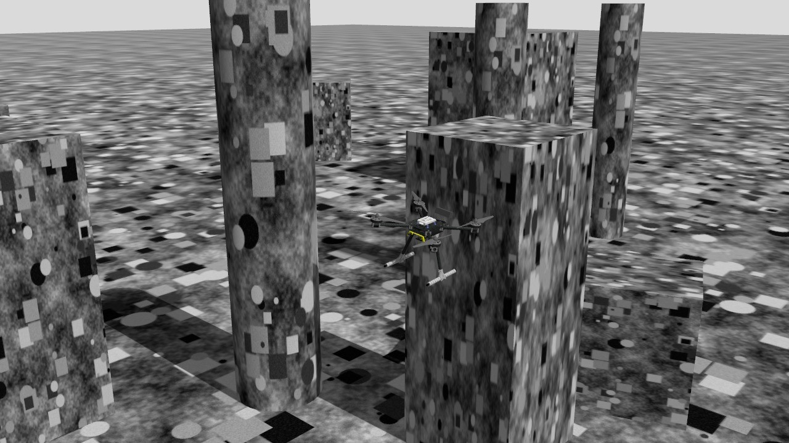
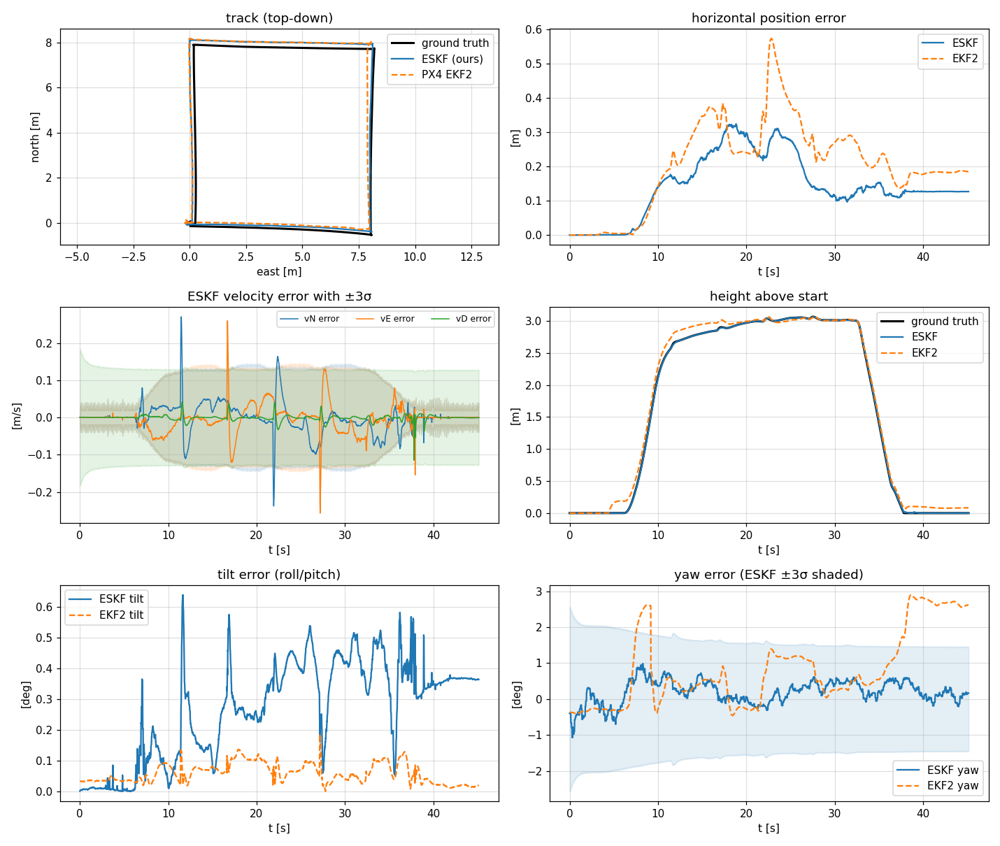
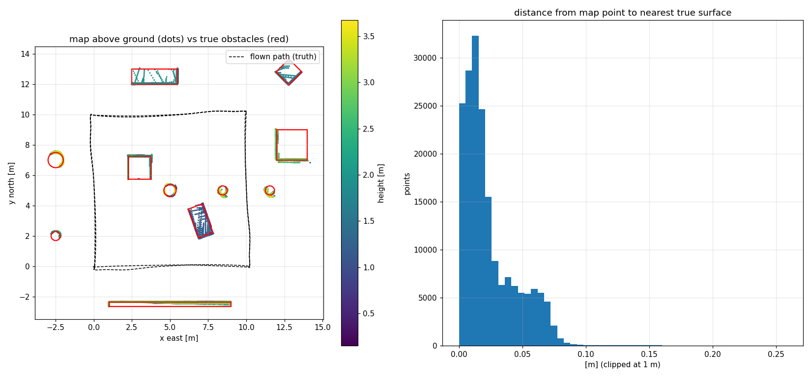
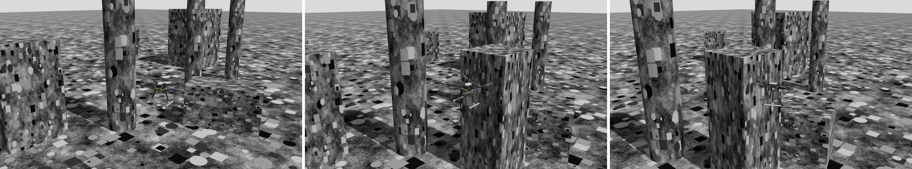
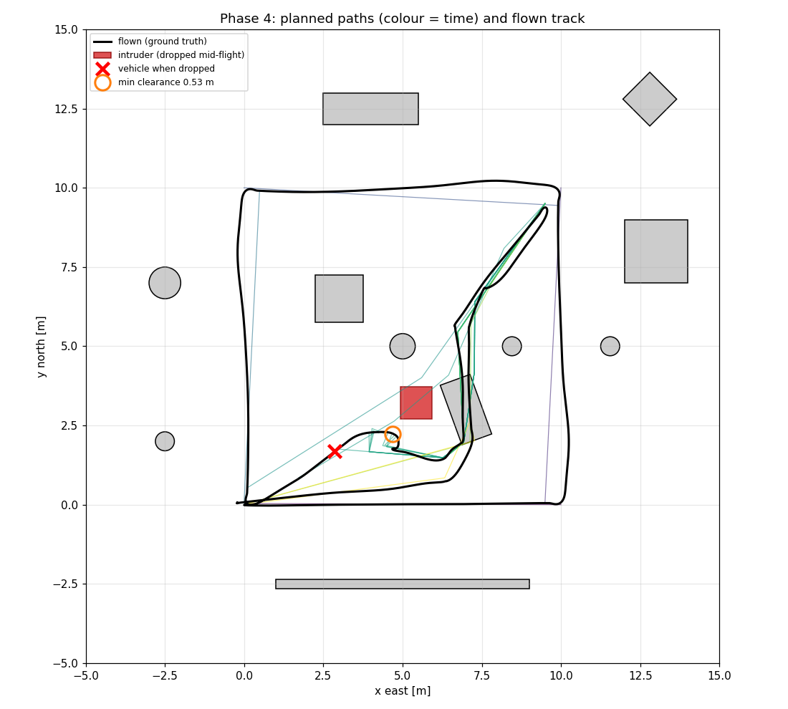
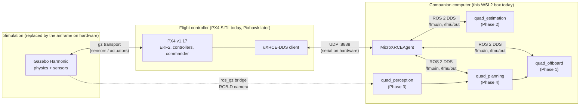

# quad-autonomy-sim

An autonomous quadrotor, built end to end in simulation on the same flight
stack real drones use. It flies with **PX4** (the autopilot firmware on
Pixhawk flight controllers), simulated in **Gazebo Harmonic**. The autonomy
software is **ROS 2** nodes written in C++20: a hand-rolled state estimator,
RGB-D mapping, and a 3D planner that replans when the world changes mid-flight.



*The final demo in Gazebo. A 2.6 m box has just been dropped onto the drone's
planned path, a few metres ahead of it. The drone sees it in its depth camera,
replans in about 0.1 s and flies around it.*

## Why it's built this way

The point was to build the whole loop the way it would be built for a real
vehicle, not a simplified version of it:

- **Real flight stack, real boundary.** PX4 runs as software-in-the-loop, and
  everything custom talks to it only through the uXRCE-DDS `/fmu/in` and
  `/fmu/out` topics. That is the same interface a Pixhawk exposes to a
  companion computer, and PX4 keeps ownership of stabilisation and failsafes.
  Moving to hardware is a transport and config change
  ([hardware_migration.md](docs/hardware_migration.md)).
- **Measured, not eyeballed.** Every phase is scored against Gazebo's ground
  truth by an evaluation script with thresholds fixed in advance. Maps are
  placed in the world by measurement rather than fitted to it, because fitting
  would hide exactly the errors worth finding.
- **C++20 where it matters.** The estimation, planning and control nodes are
  C++20, with their core logic ROS-free and unit-tested. Python is only used
  for launch files and offline analysis.

## The four phases

Each phase is a working milestone with a demo, a scored result and a design
write-up, and is tagged in git.

| phase | what it adds | tag | write-up |
|---|---|---|---|
| 1. Bring-up | PX4 SITL + Gazebo + the ROS 2 bridge; a C++ node flies a square in offboard mode | `phase1-bringup` | [phase1_bringup.md](docs/phase1_bringup.md) |
| 2. State estimation | a hand-rolled error-state Kalman filter, scored against ground truth, with real-time discipline | `phase2-estimation` | [phase2_state_estimation.md](docs/phase2_state_estimation.md) |
| 3. Perception + SLAM | an RGB-D camera and RTAB-Map mapping a cluttered world, map scored against the true geometry | `phase3-slam` | [phase3_perception_slam.md](docs/phase3_perception_slam.md) |
| 4. Autonomy loop | RRT* planning over the map; fly, detect a new obstacle, replan | `phase4-autonomy` | [phase4_autonomy.md](docs/phase4_autonomy.md) |

### 1. Bring-up

A stock PX4 x500 in Gazebo, bridged to ROS 2, and a C++ node that arms, takes
off, flies a square with velocity setpoints and lands. It is small, but it
sets the rules everything later follows: NED only at the PX4 boundary, the
node gives up control the moment PX4 leaves offboard mode, and every demo is a
single command that flies, records and checks the result.

### 2. State estimation

An error-state EKF that fuses the IMU with optical flow, a downward
rangefinder and a magnetometer, running in shadow mode next to PX4's own EKF2
on a GPS-less drone over a textured field. On a held-out flight it tracked
position to 0.34 m RMS (EKF2: 0.48 m) and altitude to 1.1 cm (EKF2: 14 cm).
The real-time design is the other half: a sensor thread that owns the filter,
a handoff to an output thread that never blocks, fixed-size math, and **zero heap
allocations in the hot path**, counted live. The IMU callback averages about
10-14 µs.



### 3. Perception + SLAM

An x500 with a forward RGB-D camera laps a generated world of 11 obstacles
while RTAB-Map builds a 3D map on PX4's odometry. `eval_map.py` then measures
every map point against the true obstacle surfaces from the world file. The
best maps have a median error of about 2 cm, with no phantom points.
Getting there is its own story (below).



### 4. Autonomy loop

The planner builds a 10 cm voxel grid from RTAB-Map's map plus the live depth
image. It inflates the grid by a margin budgeted from measured errors, plans
with RRT* and shortcut smoothing, and checks the path in force five times a
second. In five scored runs, the vehicle reached every goal and reacted to
the dropped obstacle in 0.08-0.15 s. Its closest pass to any real surface was
0.47 m, and it planned in about 30 ms per replan against a 400 ms budget.



*The same moment from a chase camera: the clear path, the box dropped into it
(0.7 s later), and the drone passing its side three seconds after that.*



*The whole mission from above. The drone laps the field to map it, then
crosses it diagonally; the red box is the one dropped mid-flight. The thin
lines are the planner's paths over time; the black line is where the vehicle
actually flew. The track crossing the tilted box near (7, 3) is not a
collision: that box is 1.2 m tall, and the planner flies over it.*

## Things that broke

Most of the interesting work was in the failures. A few favourites, each
written up in full in the phase docs:

- **The drone dropped out of offboard mode, but only with the GUI open.** The
  setpoints were fine. The DDS bridge converts timestamps with a clock offset
  that goes stale when the simulation runs slightly slower than real time, so
  fresh setpoints looked a second old. The fix was one field: send timestamp 0,
  meaning "stamp on arrival".
- **Gazebo's magnetometer was wrong whenever the drone tilted.** An axis
  remap fixed the tilt but broke GPS flights elsewhere. The final fix switched
  to PX4's own magnetometer simulator, with a small PX4 patch.
- **The planner's map had ghost walls**, and the vehicle kept replanning
  around obstacles that weren't there. It came down to three separate causes:
  - PX4's EKF2 was running 0.1 s *ahead* of reality: it compensated a GPS delay
    the simulator doesn't have.
  - RTAB-Map's loop closures were bending the map. The same database scored
    7.5 cm median error with them and 1.9 cm without.
  - The first two map frames were taken before the estimator knew which way
    it was facing.
- **The drone skipped its own evasive manoeuvre.** A harmless-looking rule
  that ignored waypoints within 1 m also threw away the short sidestep of an
  evasive path. The vehicle cut straight at the obstacle's margin, and the
  planner replanned every 0.1 s in a loop.

## How it fits together



| layer | in this repo | on a real vehicle |
|---|---|---|
| physics, sensors | Gazebo Harmonic | the airframe and its sensors |
| flight control | PX4 v1.17 SITL | the same PX4 release on a Pixhawk |
| flight controller to companion link | uXRCE-DDS over UDP | uXRCE-DDS over UART or Ethernet |
| autonomy | ROS 2 Humble nodes in `ros2_ws/` | the same nodes on a Jetson, Pi or NUC |

More in [architecture.md](docs/architecture.md).

```
firmware/        PX4 parameters and the two small PX4 patches
sim/             Gazebo worlds and models (generated obstacle fields, the RGB-D x500)
ros2_ws/src/
  quad_offboard/     offboard flight node and waypoint follower
  quad_estimation/   error-state EKF node + offline replay
  quad_perception/   PX4 odometry bridge, RTAB-Map launch
  quad_planning/     voxel grid, RRT*, planner node
scripts/         setup, simulator launcher, one-command demos, evaluation
docs/            per-phase design write-ups, architecture, verified environment
```

## Running it

Built and tested on WSL2 with Ubuntu 22.04, ROS 2 Humble, PX4 v1.17.0 and
Gazebo Harmonic 8.15. Four setup scripts install and build everything, and each
phase has a one-command demo (`scripts/demo_phaseN.sh`) that flies it and
scores the result. Setup, the demos and how to run each phase by hand are in
[docs/running.md](docs/running.md). Exact versions are in
[docs/environment.md](docs/environment.md).

## License

MIT, see [LICENSE](LICENSE). The patches in `firmware/px4_patches` modify PX4
and stay under PX4's BSD 3-Clause license.
