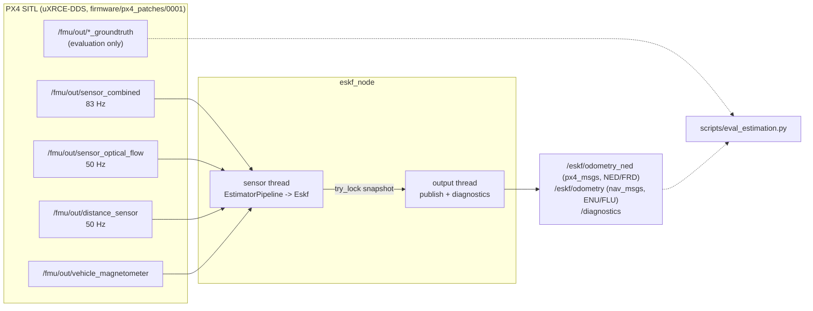

# Phase 2: State estimation (design record)

**Status: done, tag `phase2-estimation`.** A hand-rolled C++20 error-state EKF
(`ros2_ws/src/quad_estimation`) fuses IMU, downward optical flow, a downward
rangefinder and magnetometer heading. It runs in shadow mode next to PX4's EKF2,
which keeps flying the vehicle, and is scored against Gazebo ground truth.

## Results

Two validation flights with the final configuration, both on the `x500_flow`
airframe (no GPS) over `sim/worlds/flow_field.sdf`. Flight B's path, speed and
altitude were not used for any tuning. EKF2 uses the same sensors.

| | A: 8 m square, 3 m, 2 m/s | | B: 12 m square, 4 m, 3 m/s (held out) | |
|---|---|---|---|---|
| | **ESKF** | EKF2 | **ESKF** | EKF2 |
| horizontal position RMSE | **0.156 m** | 0.163 m | **0.343 m** | 0.483 m |
| horizontal drift at end | 0.4 % of path | 0.1 % | 0.4 % | 0.4 % |
| altitude RMSE | **0.011 m** | 0.094 m | **0.011 m** | 0.144 m |
| velocity RMSE | 0.070 m/s | 0.073 m/s | 0.089 m/s | 0.088 m/s |
| tilt (roll/pitch) RMSE | 0.36 deg | **0.075 deg** | 0.64 deg | **0.077 deg** |
| yaw RMSE | **0.36 deg** | 1.09 deg | **0.59 deg** | 1.26 deg |
| NEES velocity / attitude (ideal 3 / 3) | 3.1 / 0.7 | | 4.1 / 2.5 | |

Real-time behaviour, measured live on the sensor thread (from `/diagnostics`):

| IMU callback (predict + all fusion) | mean | p99 | max | budget | overruns | heap allocations in our callbacks |
|---|---|---|---|---|---|---|
| flight A | 13.2 us | 40 us | 138 us | 1000 us | 0 | **0** |
| flight B | 13.6 us | 40 us | 80 us | 1000 us | 0 | **0** |

Honest reading of the table:
- Horizontal navigation matches EKF2. Altitude and yaw are better. The altitude
  gap is partly configuration: EKF2 keeps the default height reference
  (`EKF2_HGT_REF=1`, GPS, which this airframe lacks), while ours measures height
  with the rangefinder over flat ground. That advantage only holds over flat
  ground.
- **Tilt is 5-8x worse than EKF2** (see "Known limitations").
- The filter is statistically consistent: its reported covariance matches its
  actual errors (NEES near the number of degrees of freedom).

Reproduce: `scripts/demo_phase2.sh --headless` (flight A), or
`SQUARE_SIDE=12 ALTITUDE=4 SPEED=3 scripts/demo_phase2.sh --headless` (flight B).

## Data flow



## Filter

**State.** Nominal: position and velocity (world NED), attitude quaternion (FRD
body to NED), gyro bias, accelerometer bias. Error state: 15 values, with the
attitude error expressed in the body frame (`q_true = q * Exp(dtheta)`). This
follows Sola, *Quaternion kinematics for the error-state Kalman filter*.

**Prediction** runs on every IMU sample. `sensor_combined` carries the
interval-average rate and specific force plus the interval length
(`gyro_integral_dt`), so integration never uses timestamp differences. The
covariance is propagated as `F P F' + Q`, with Q from continuous noise densities.

**Measurements** (models in `eskf.cpp`; every analytic Jacobian is checked
against finite differences in `test_eskf`):

| sensor | measurement | model h(x) |
|---|---|---|
| rangefinder | slant range r | `(ground_z - p_z) / R22` (flat ground) |
| optical flow | `gyro_xy - pixel_flow/dt` [rad/s] | `(R22 / hagl) * [v_body_y, -v_body_x] + bg_xy` (EKF2's convention) |
| magnetometer | heading from the tilt-compensated field + declination | `atan2(R10, R00)` |

The flow sensor reports no gyro of its own. Its rotation compensation uses our
own raw gyro, averaged over the flow's integration window from a short IMU
history. The bias term in the flow model is there because that gyro is raw, and
it lets flow help estimate `bg_xy`.

**Updates** apply a chi-square innovation gate (NIS), use a Joseph-form
covariance update, inject the error into the nominal state, and apply the ESKF
covariance reset Jacobian. Range and flow are skipped below 8 cm height and
beyond 37 deg of tilt.

**Initialisation** is a static alignment. The filter waits for about 1.2 s of
still IMU data, then takes roll/pitch from gravity, gyro bias from the mean
rate, yaw from the magnetometer, and ground height from the rangefinder. Motion
during alignment restarts it.

## Real-time design

| requirement | how | where |
|---|---|---|
| bounded-time callbacks | Fixed 15x15 algebra. Measurement rings and the IMU history have compile-time capacity, so the worst case is the only case. A timing histogram per callback, plus overrun counts against a budget. | `eskf.cpp`, `fixed_ring.hpp`, `timing_stats.hpp` |
| no heap allocation in the hot path | Fixed-size Eigen only. The unit tests run predict/update with Eigen's runtime malloc trap armed. Live, a replaced `operator new` counts every allocation made inside our callback bodies. Subscriptions take messages from pre-allocated pools (`MessagePoolMemoryStrategy`). | `test_eskf.cpp`, `alloc_probe.cpp` |
| explicit executor / callback-group design | Two groups on two SingleThreadedExecutors, each with its own thread. The **sensor group** (IMU, flow, range, mag) owns all filter state, so it needs no locks. The **output group** holds the 50 Hz publisher, the 1 Hz diagnostics and parameter services: everything that allocates. | `eskf_node.cpp` (header comment) |
| never block the hot path | The sensor thread hands a POD snapshot over with `try_lock`. If the output thread holds the lock, that snapshot is skipped and counted, never waited for. | `eskf_node.cpp` `write_snapshot` |
| priority | `sensor_thread_priority` > 0 requests SCHED_FIFO. WSL2 refuses it (no rtprio); a companion computer can grant it. | `eskf_node.cpp` `main` |

**What the numbers do not claim.** "0 allocations" covers our callback bodies.
The same thread also runs rclcpp's executor and take path, which allocated about
3 times per message in ROS 2 Humble, even with message pools
(`sensor_thread_allocations` in `/diagnostics`). Removing those means a
different executor or a real-time allocator, and is out of scope here. Also,
WSL2 is not a real-time OS: the p99 and max values are what this machine
delivered, not guarantees.

**Build type matters.** An unoptimised build (no `CMAKE_BUILD_TYPE`) ran the
same callback at a mean of 372 us (p99 915 us) and overran the budget. Both
packages now default to `RelWithDebInfo`.

## Timestamps

Every input carries PX4 time after uXRCE-DDS timesync. Timesync produces two
kinds of artefact, both seen in this project:

- a **one-off glitch**: one sample stamped with raw PX4 boot time (about 57 years
  off);
- **persistent clock steps**: −0.31 s on re-convergence, and +2 to +8 s steps
  whenever the simulator ran slower than real time, which shifts PX4's clock
  against the host's.

They look identical on the first sample. `EstimatorPipeline` therefore accepts
a jump as a step only once the next IMU sample confirms the new timeline, and
otherwise ignores it. It counts both (`suspect_stamps`, `clock_steps`). A glitch
can even land on the exact sample where a step happens; the confirm-twice rule
handles that too (tests in `test_support.cpp`). The evaluation tooling undoes
the same steps, using the IMU stream's step sizes so every stream gets identical
corrections (`scripts/lib/px4_csv.py`).

## Simulator findings

Most of Phase 2's effort went into making the *simulated sensors* trustworthy.
Each finding below was measured against ground truth before it was fixed.

| # | finding | evidence | fix |
|---|---|---|---|
| 1 | **The bridge dropped about 60% of IMU data.** PX4 integrates the IMU at 250 Hz, but uXRCE-DDS forwards `sensor_combined` at about 100 Hz, latest sample only. | 4 ms integrals arriving 4-16 ms apart | `IMU_INTEG_RATE 100`: each message now covers its whole interval (100% coverage, checked) |
| 2 | **Optical flow was useless over the stock worlds.** The flow sensor is a real camera plus OpenCV, and the ground plane is flat grey. | PX4's own EKF2 diverged by 70 m and triggered a failsafe | `sim/worlds/flow_field.sdf`: the same world with a generated, tileable, multi-scale ground texture |
| 3 | **Gazebo Harmonic's magnetometer is unusable in tilted flight.** PX4's axis mapping (`-y, -x, z`, with an upstream FIXME) is only consistent while level. Read with a tilt-consistent mapping, the field then points about 90 deg from the WMM field PX4 expects. | Level: 0.7 deg heading error; in flight: 15 deg. A fitted tilt-consistent mapping gave a 0.0003 G residual, but moved the declination to −92.6 deg, which made GPS flights toilet-bowl (EKF2 initialises from the WMM). | `SENS_EN_MAGSIM 1`: PX4's own `sensor_mag_sim` (WMM field, ground-truth attitude). Patch `0002` makes gz_bridge skip Gazebo's magnetometer in that case. Measured afterwards: declination 3.54 deg, constant at rest and in flight. |
| 4 | **Bad magnetometer data poisoned later flights.** `SENS_MAG_AUTOCAL` saves EKF2's learned mag biases into the calibration at every disarm. | `CAL_MAG0_XOFF` = −0.037 G "learned" from the bad data | Autocal off, SITL offsets pinned to 0 |
| 5 | **`EKF2_MAG_DECL` needs bit 1 of `EKF2_DECL_TYPE` in v1.17.** With 0, EKF2 uses 0 deg declination and ignores the parameter. | EKF2 yaw was off by exactly the declination | `EKF2_DECL_TYPE 2` |
| 6 | **The flow sensor itself is clean.** | Residual 0.013 rad/s against ground truth; scale 1.013; no measurable latency | Tuned noise 0.04 rad/s (3x margin) |

Tooling problems found along the way, all fixed: `ros2 run` wrappers orphaned
nodes (an old estimator kept publishing into the next run); the ROS 2 CLI
daemon got stuck and silently failed calls (all scripts now use `--no-daemon`);
`ros2 topic list` answers from a cache (the demos now wait for real messages);
and an early version of the evaluation used `np.interp` on a corrupted time
axis. `np.interp` clamps silently, which faked a "5 mm" EKF2 error, so the
evaluation now refuses out-of-range times.

## Validation method

- **Ground truth** comes from gz_bridge's `vehicle_local_position_groundtruth`
  and `vehicle_attitude_groundtruth`, exported over DDS by patch `0001`. They
  are used only by `scripts/eval_estimation.py`, never by the filter.
- **Positions are compared as displacement** from the moment the ESKF
  initialises (flow gives no absolute horizontal reference). Attitude and
  velocity are compared directly.
- **Metrics:** RMSE per quantity, final drift as a % of path length, and NEES
  from the published (diagonal) variances.
- **Acceptance thresholds** (`--check`): velocity 0.35 m/s, tilt 2 deg, yaw
  5 deg, altitude 0.25 m, drift 10 % of path. They were set before the final
  results.
- **Baseline:** PX4 EKF2 on the same sensors. It flies the vehicle; ours only
  watches.

## Tuning

Noise parameters come from sensor measurements (flow residual, magnetometer
noise). The final choice was made on **consistency, not minimum error**.
`eskf_replay` runs recorded flights through the same `EstimatorPipeline` code
the node runs live; the live and replayed RMSE agree to about 1 cm. Accuracy
was flat across a range of flow-noise values until the filter became
overconfident. The chosen values bring velocity NEES to about 3 of 3, and they
held on the unseen flight B.

```bash
python3 scripts/prepare_replay.py logs/phase2_<ts>
ros2_ws/install/quad_estimation/lib/quad_estimation/eskf_replay \
  --in logs/phase2_<ts>/replay --params ros2_ws/src/quad_estimation/config/eskf.yaml \
  --out logs/phase2_<ts>/est_replay.csv --set flow_noise_best=0.08
python3 scripts/eval_estimation.py logs/phase2_<ts> --est logs/phase2_<ts>/est_replay.csv
```

## Known limitations

- **Tilt accuracy** trails EKF2 by 5-8x, and errors spike at the square's
  corners (up to about 1.3 deg, with 0.4 m/s velocity transients). One tested
  and rejected hypothesis: using the mid-interval attitude in the strapdown
  update changed nothing measurable. Remaining candidates: no delayed-state /
  out-of-sequence fusion (EKF2 fuses on a delayed horizon), the flow sensor's
  lever arm (10 cm below the IMU) not being modelled, and tilt / accel-bias
  ambiguity during constant-heading flight.
- **Flat-ground assumption:** a fixed `ground_z`. Terrain or obstacles under
  the vehicle will be gated out, not tracked. Phase 3's cluttered world will
  need a terrain state.
- **Middleware allocations** on the sensor thread (see above).
- **No `robot_localization` baseline:** EKF2 on identical sensors turned out to
  be the more informative comparison.
