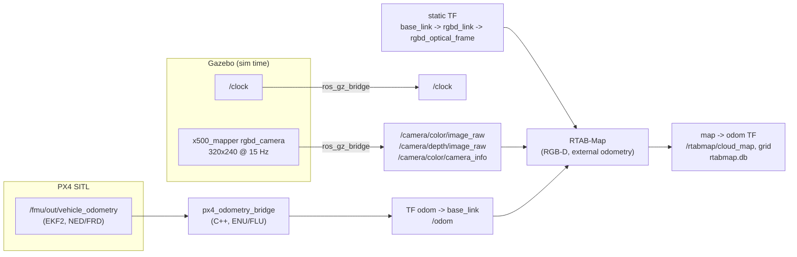

# Phase 3: Perception + SLAM (design record)

**Status: done, tag `phase3-slam`.** An x500 with a forward RGB-D camera flies
two laps of a scripted route through a cluttered world while RTAB-Map builds a
3D map live. The map is then scored against the world's true geometry.

## Results

Final runs of `scripts/demo_phase3.sh --headless` (two laps of a 10 m square at
1.8 m, 1.5 m/s, facing the direction of travel):

| odometry used for mapping | median / mean distance to true surface | within 10 cm | within 20 cm | phantoms (> 0.5 m) | obstacles seen / mean coverage |
|---|---|---|---|---|---|
| **PX4 EKF2** (what a real vehicle has) | **6.4 / 8.1 cm** | 68.7 % | 94.9 % | 0.00 % | 11/11, 61.1 % |
| Gazebo ground truth (sim-only diagnostic) | 1.5 / 1.8 cm | 100 % | 100 % | 0.00 % | 11/11, 69.3 % |

- The map has 222k points (5 cm voxels), 153 graph nodes, about 66 loop
  closures and 2 proximity links (132 + 4 link records; RTAB-Map stores each
  link in both directions).
- RTAB-Map's update took 177 ms median (342 ms max) against its 500 ms budget
  (2 Hz).
- With the Gazebo GUI open (after the offboard timestamp fix, see "Findings"):
  3/3 runs passed, with median errors of 4.7, 4.8 and 6.4 cm and 97-98 % of
  points within 20 cm.
- Run-to-run variation is real. EKF2's odometry differs every flight, and an
  earlier EKF2 run scored 4.9 cm median, but that run shared the machine with a
  stale Gazebo server (see "Findings"), so only the clean runs above are
  reported. The RGB-D camera itself cost no measurable real-time factor (0.9997
  with it rendering, measured before flight). The real-time factor during the
  mapping flights was not recorded.
- Acceptance thresholds (`scripts/eval_map.py`, set before the final runs):
  median error ≤ 10 cm, ≥ 85 % of points within 20 cm, ≤ 3 % phantoms, ≥ 50 %
  mean coverage of the obstacles seen. Both runs pass.

**Where the error comes from.** With perfect odometry, the same camera, frames
and RTAB-Map setup give 1.5 cm median error and nothing beyond 10 cm. So the
mapping pipeline is sound, and the remaining error in the real configuration is
the odometry. EKF2's error over the clean flight measured 0.13 m RMS horizontal
(max 0.25 m), 0.04 m RMS vertical and 1.9 deg RMS heading (max 2.8 deg). At 5 m range, a 2 deg heading error places
the same object about 17 cm apart when it is seen from different parts of the
route. That is the ghosting visible around the centre pillar in `map.png`.

This test cannot tell EKF2's inaccuracy apart from the arrival-time stamping
described below, because the ground-truth path uses exact simulation stamps for
both. Separating the two is future work.

Reproduce:

```bash
scripts/demo_phase3.sh --headless                   # EKF2 odometry
ODOM_SOURCE=gt scripts/demo_phase3.sh --headless    # ground-truth odometry (diagnostic)
```

Each run leaves `logs/phase3_<ts>/rtabmap.db`, openable in
`rtabmap-databaseViewer`, plus `cloud.ply`, `map.png` and `map_metrics.json`.

## Design



**Sensor.** `sim/models/x500_mapper` is PX4's x500 plus one Gazebo
`rgbd_camera`. Colour and depth come from one viewpoint with one set of
intrinsics, which is what RTAB-Map's RGB-D mode needs. It is 15 cm forward, 5 cm
up and pitched 15 deg down, with an 86 deg horizontal field of view, 10 m depth
range and 320x240 at 15 Hz. It renders headless through WSLg with no measurable
loss of real-time factor.

PX4's own `x500_depth` was rejected: its 1080p colour camera and 640x480 depth
camera have different fields of view, and rendering 1080p at 30 Hz slows the
lockstep simulation. The published intrinsics were checked against the SDF
(fx = fy = 171.748 px = (w/2) / tan(fov/2)).

**Spawning a project vehicle without touching PX4.** PX4 SITL picks an
airframe by model name, and PX4 has no airframe for `x500_mapper`. Instead,
`scripts/sim.sh` handles any `sim/models/<name>` that has a `px4_airframe` file:
it starts Gazebo itself, spawns the model, and starts PX4 with
`PX4_SYS_AUTOSTART` (the stock x500, 4001) and `PX4_GZ_MODEL_NAME`. This is
PX4's supported "attach to an existing model" path.

**Odometry.** RTAB-Map maps on PX4 EKF2's odometry. `px4_odometry_bridge`
(C++) converts NED/FRD to ENU/FLU, using the frame helpers unit-tested in
Phase 2, and broadcasts `odom -> base_link`. Phase 2's ESKF is **not** used
here: it assumes flat ground under its rangefinder, and this world has
obstacles under the flight path. Feeding the ESKF into mapping needs a terrain
state (see Phase 2's limitations).

**Time.** Every Phase 3 node runs on simulation time. Gazebo stamps the images
with sim time. PX4's stamps are in a different time base (PX4 time plus the
timesync offset, with steps; see Phase 2), so the bridge stamps each odometry
sample with the sim clock on arrival. The price is the DDS transport latency.

**RTAB-Map** (`config/rtabmap.yaml`, every non-default value commented):
- 6-DoF registration;
- a node every 0.2 m / 0.15 rad, at most 2 Hz;
- a 3D occupancy grid at 5 cm, ray-traced, out to 8 m (the input for Phase 4);
- ground segmentation by normals off (on a flying vehicle the ground is just
  another surface);
- a gravity prior, so loop closures cannot tilt the map.

**Route.** `quad_offboard` gained a generic route (`route_nea`, north / east /
altitude triples from the start), `laps`, and `yaw_mode:=travel`, so the forward
camera looks where the vehicle goes. It also gained an optional yaw-rate limit
(`max_yaw_rate_dps`).

## World and ground truth

`sim/worlds/cluttered.sdf` is generated by `sim/tools/generate_cluttered_world.py`
from one obstacle list: 11 textured boxes and cylinders, including a wall, a
low box, tall pillars and a two-pillar gate the route passes through. The
generator checks the exact footprint geometry against the route and refuses
any obstacle closer than 1.2 m; that check caught the first gate layout. In
flight, the closest measured approach to any surface was 1.19 m.

`scripts/eval_map.py` reads the same SDF back as ground truth. The map is
placed in the world by **measurement, not fitting**:

- map origin = EKF2's local origin;
- world position of that origin = PX4 ground-truth reference point (from
  `ref_lat/ref_lon/ref_alt`, placed with the world's geodetic origin)
  + ground truth(t0) − EKF2(t0).

Fitting the cloud to the geometry (ICP) would hide exactly the errors being
measured. The evaluator's geometry was tested on synthetic points (exact to
1e-14 m).

## Findings along the way

The absolute numbers in this table come from runs made before the stale-server
fix (last row but one). Each finding is a before/after comparison within that
same setup; the conclusions were not re-verified on clean runs.

| finding | evidence | outcome |
|---|---|---|
| PX4's ground-truth local position is relative to the vehicle's **start**, not the world origin (`ref_*` fields) | the map's ground sat at −0.26 m; median error read 22.5 cm | alignment now includes the reference point; median 3.6 cm on the same map |
| `rtabmap-export --cloud` appends `_cloud` to the output name, and the default `--max_range` of 4 m silently trims the map | first run "exported nothing"; range default read from `--help` | demo renames the file and passes `--max_range 8` (matches `Grid/RangeMax`) |
| PCL-written PLY files carry a `camera` element after the vertices | parser read the wrong record size | parser tracks elements; regression-tested with that exact layout |
| "face travel" turns at up to **144 deg/s** at corners | truth heading rate | added `max_yaw_rate_dps` and tested 30 deg/s: no accuracy gain (median 4.1 vs 3.6 cm), and coverage of interior obstacles collapsed (36 % to 5-7 %). The demo keeps unlimited yaw; the fast corner sweep is what shows the forward camera the loop's interior. |
| **With the Gazebo GUI open, PX4 dropped to Hold at waypoint 4, every time** (reported by the user; reproduced). It was not the battery (a "battery warning" tone was incidental), not a slow simulation (real-time factor ~1.0), and not our node (1,369 setpoints, every gap 52 ms). PX4 flagged `offboard_control_signal_lost` with velocity still valid, so the setpoints *looked* older than `COM_OF_LOSS_T` (1 s). The uXRCE-DDS client converts incoming stamps with its timesync offset, which goes stale between corrections while the simulation runs a few percent off real time. The flag flickered right at the 1 s boundary before it stuck. | PX4's generated deserialiser: a stamp of 0 means "stamp on arrival" | the offboard node sends timestamp 0 on everything it sends to PX4. GUI demo: 0/3 passes before, 3/3 after (map medians 4.7, 4.8, 6.4 cm); Phases 1-2 re-verified. |
| **A stale Gazebo server contaminated runs.** An orphaned `gz sim` server (from a manual check where the kill was not verified) survived SIGTERM, and kept rendering and simulating next to later sessions of the same world. | it was still alive 35 min later and only died to SIGKILL; a Phase 2 regression run failed (PX4 failsafe land) while it ran | `sim.sh` refuses to start while any Gazebo simulation is running, and escalates to SIGKILL on exit; the demos sweep leftovers. Every affected result was re-run clean (the numbers above). |
| RTAB-Map's `Kp/MaxFeatures=-1` in `rtabmap-reprocess` still reported loop detections | reprocess log | stopped investigating; the ground-truth-odometry test answered the underlying question directly |

## Known limitations

- **Odometry-limited accuracy:** 6.4 cm median, with a tail to about 0.4 m
  (ghosting). This comes from EKF2's roughly 2 deg heading error and 0.13 m
  position error, possibly plus arrival-time stamping. Candidates: estimate the
  PX4-to-sim time offset instead of stamping on arrival; fuse the camera into
  the odometry (visual-inertial); use RTAB-Map's own visual odometry.
- **Coverage is geometry-limited:** a forward camera on a loop sees each
  obstacle's route-facing sides. Back faces are only seen during corner sweeps.
- **Far ground at grazing angles** (8-10 m) picks up height error with EKF2
  odometry. It disappears with ground-truth odometry.
- **Same texture everywhere:** the whole world uses one texture, which invites
  wrong loop closures. None was observed to damage the map (0 phantom points),
  but a real environment should be richer.
