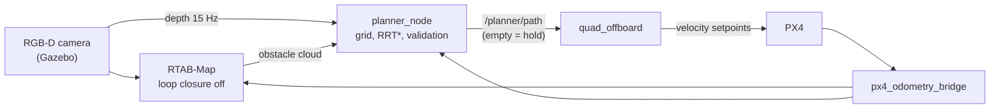

# Phase 4: Autonomy loop

**Status: done**, tag `phase4-autonomy`.

The last phase closes the loop. The vehicle maps the field as it flies, plans
3D paths over that map, flies them, and replans when the world changes under it.
In the demo, a 2.6 m box is dropped onto the path in front of the drone
mid-flight.

## The demo

`scripts/demo_phase4.sh` flies `x500_mapper` through `sim/worlds/demo_final.sdf`
(the Phase 3 field plus a movable "intruder" box and a fixed overhead camera).
The mission is six goals in the odometry frame:

1. A lap of the field: (10, 0), (10, 10), (0, 10), (0, 0). Every leg is planned,
   but the map starts empty, so the first legs are mostly straight lines that
   get corrected as obstacles come into view.
2. A diagonal crossing to (9.5, 9.5), through the middle of the field and
   around the obstacles the lap mapped.
3. Three metres into the crossing, `scripts/scenario_intruder.py` moves the
   intruder onto the planned path, about 3 m ahead of the vehicle.
4. The planner sees it in the depth image, replans around it, finishes the
   crossing and flies back to the start, where the flight node lands.

The fixed camera records the flight to `flythrough.mp4`, and
`scripts/eval_mission.py` scores the run against the world's true geometry.

## Results

Five final runs (three headless, two with the Gazebo GUI), all passing:

| run | min clearance to a true surface | reaction to the intruder | plans (replans) | planning time mean / max | flown | planner map: median error, phantoms |
|---|---|---|---|---|---|---|
| headless 1 | 0.53 m | 0.08 s | 29 (23) | 28 / 35 ms | 73.4 m | 2.2 cm, 0 % |
| headless 2 | 0.66 m | 0.14 s | 28 (22) | 28 / 37 ms | 74.3 m | 2.4 cm, 0 % |
| headless 3 | 0.47 m | 0.15 s | 28 (22) | 29 / 36 ms | 72.5 m | 2.2 cm, 0 % |
| GUI 1 | 0.48 m | 0.12 s | 36 (30) | 30 / 37 ms | 75.0 m | 2.0 cm, 0 % |
| GUI 2 | 0.61 m | 0.10 s | 25 (19) | 31 / 43 ms | 73.6 m | 3.5 cm, 0 % |

Every run reached all six goals and landed, in 59-62 s of simulated mission
time. The closest approach is always to the intruder, which the vehicle first
sees from 3 m away at 1.5 m/s. The static obstacles, mapped in advance, are
passed with more room. "Map" is RTAB-Map's part of the planner's occupancy; the
live-depth part scores 0.3-4.4 cm, also with no phantoms.

Acceptance thresholds (`scripts/eval_mission.py`, fixed before the final runs):
every goal reached and landed; at least **0.40 m** from any true obstacle
surface (the x500's arms reach about 0.35 m); the intruder blocks the path in
force and a plan that clears it arrives within **1.0 s**; no plan over the
**400 ms** budget; at most **3 %** phantom points in the planner's map (Phase 3's
standard).

## Design



### Where it plans: the odometry frame

Everything is planned in `odom`, PX4's local frame in ROS conventions. That is
the frame `quad_offboard` flies in, so a path can be flown as it is, with no
dependence on the SLAM system's corrections. RTAB-Map's obstacle cloud (frame
`map`) is brought into `odom` with TF.

This only works if the map is consistent with odometry, which it wasn't at
first (see *Findings*). Phase 4 runs RTAB-Map with loop closure off. On
GPS-aided odometry that costs nothing, because there is no drift to correct.

### Occupancy

`VoxelGrid` is a fixed 30 x 30 x 4.5 m grid at 10 cm (4 million cells) covering
the field. It is rebuilt from scratch every planning cycle from two sources:

- **RTAB-Map's obstacle cloud**, the long-term memory of everything seen.
- **Live depth**, every 4th pixel out to 6 m, projected with TF at the image
  stamp and kept for 4 s. This is what sees a new obstacle within a frame or
  two, long before RTAB-Map adds a node for it.

Points within 0.25 m of the ground are dropped. The grid is then inflated
twice with a box dilation (separable, one sliding-window pass per axis, so the
cost does not grow with the radius):

| margin | value | used for |
|---|---|---|
| planning | 0.75 m | RRT* plans against this |
| hard | 0.55 m | a path is only "blocked" if it violates this |

The planning margin is an error budget, not a guess: arm radius ~0.35 m,
EKF2 position error ~0.15 m, path-tracking error ~0.25 m. The gap between
the two margins is hysteresis. Without it, every depth frame that nudged a
cell into the margin of a path skirting an obstacle triggered a replan.

Unseen space counts as free. That is optimistic, so paths are confined to an
arena around the mission area (x, y in [-4, 14] m, z from 1.0 to 2.8 m).
Without that limit, early plans happily routed around the whole field through
space nobody had looked at.

Rebuilding and inflating the grid takes about 16 ms. All four grids are
allocated once, at startup.

### Planner

`RrtStar` is a 3D RRT* with a fixed node pool (4,000 nodes, reserved once), a
1 m step, a 2.5 m rewire radius and 10 % goal bias. It is anytime: it keeps
improving the path until the node pool or the 400 ms time budget runs out.
If the straight segment from start to goal is free it returns that without
sampling, which is most legs of the first lap.

The raw tree path is smoothed by greedy shortcutting: from each waypoint, jump
to the farthest later waypoint with a free straight segment. Plans take about
30 ms in practice, far inside the budget.

Two details matter more than they look:

- **Seeding.** Every plan toward a given goal uses the same random seed, so a
  replan on a slightly changed map tends to reproduce a similar path instead of
  a random new one. After a failure the seed changes. With the same seed on a
  near-identical map, a failed search just fails again: one early run failed
  13 times in a row that way.
- **Start and goal inside the margin.** The vehicle can legitimately be inside
  the planning margin while passing an obstacle. `free_near` plans from the
  nearest free point instead of failing, and the path is prepended with the
  vehicle's actual position.

### Mission and replanning

The planner runs a 5 Hz loop on its own thread (a separate callback group from
the data callbacks, sharing a short mutex-protected handoff):

1. Rebuild and inflate the grid.
2. Wait until the vehicle has climbed to the flight band. A path planned from
   the ground would replace the flight node's climb.
3. Goal within 0.6 m: next goal, or publish `mission_complete`.
4. Check the path in force against the hard grid, only within 5 m ahead of the
   vehicle. Blockages further out are re-checked as the vehicle gets closer and
   the map there improves. Checking the whole path made distant map updates
   trigger replan after replan.
5. Replan if there is no path or it is blocked.

A failed plan publishes an **empty path**, which `quad_offboard` treats as
"stop and hold position". The alternative, leaving the vehicle on a path the
planner has just found blocked, is the one thing it must never do.

Every plan and goal is logged as one JSON line (`/planner/events`, and
`events.jsonl` in the demo). That log is what made most of the findings below
diagnosable.

### Flying the path

`quad_offboard` gained `route_source:=planner`. It subscribes to the latched
`/planner/path`, converts ENU to NED, and flies it with the same waypoint
follower as Phase 1: a P controller on position error, speed-capped at
1.5 m/s, facing the direction of travel so the forward camera looks where the
vehicle is going. An empty path means hold; `mission_complete` means land; no
path for 90 s means land as well.

### Real-time notes

Planning is soft real time. A replan costs about 16 ms of grid work plus about
30 ms of RRT*, and while the planner thinks, `quad_offboard` keeps streaming
the last setpoint. The bounded parts are bounded by construction: grids and
the node pool are allocated once, and RRT* stops at its budget. Paths and event
strings still allocate, which is fine at 5 Hz and would not be on a control
loop. None of this runs on PX4's control loops.

## Scenario and evaluation

`scripts/scenario_intruder.py` plays the world changing, and nothing in the
flight or planning path depends on it. It waits for the crossing leg, walks
3 m ahead along the planned path, and moves the box there with Gazebo's
`set_pose` service, logging when and where.

`scripts/eval_mission.py` scores the run:

- **Clearance** is measured from the ground-truth track to the true obstacle
  surfaces from the SDF. The intruder counts at its parked pose before the move
  and at its dropped pose after.
- **Reaction** is the time from the move to the first plan that clears the
  intruder by the hard margin.
- **Map accuracy** comes from the planner's final obstacle points (both
  sources), measured against the true surfaces. That check was added after the
  map turned out to be the root of most early problems.

## Findings along the way

The early runs "worked" in the sense that the vehicle usually got home. They
also replanned 80-115 times per mission, took 25 m detours on 13 m legs, and
once sat stuck at the edge of the field for three minutes. Most of this traced
back to a few specific causes.

| finding | evidence | outcome |
|---|---|---|
| **The planner's map had ghost walls.** Box surfaces were doubled and shifted up to ~1 m; half of the occupied cells were more than 0.5 m from any real surface | failed-plan dumps (the planner can write its occupancy to disk) plotted against the SDF | three separate causes, below |
| (1) **EKF2 ran 0.1 s ahead of the truth.** PX4's simulated GPS has no latency, but EKF2 compensated for the hardware default of 110 ms (`EKF2_GPS_DELAY`) | cross-correlated odometry against two independent ground truths (Gazebo's and PX4's): best alignment at -0.10 s both times. Along the way, the suspected arrival-time stamping measured **exact** in lockstep SITL (0 ms) | `EKF2_GPS_DELAY 0` in `sitl_only.params`, as PX4's own SIH airframes do |
| (2) **RTAB-Map's loop closures bent the map.** 24 visual loop closures in a world with one repeated texture | the same database exported both ways: optimised poses 7.5 cm median error and 6.5 % phantoms; odometry poses 1.9 cm and 1.5 % | loop closure off for Phase 4 (`mapping.launch.py loop_closure:=false`). Phase 3's SLAM demo is unchanged |
| (3) **The first two map nodes had no heading.** RTAB-Map started mapping before EKF2 had aligned its yaw; its identity attitude reads as 90 deg off | per-node obstacle cells in the database traced the last phantoms to nodes 1 and 2, both on the ground at t = 8 s with exactly yaw 90, pitch 0, roll 0 | `px4_odometry_bridge` publishes nothing until PX4 first reports a valid position and heading. A first version also paused on any later flicker, and at takeoff that stalled a run; the check is now latched |
| **The drone skipped its own evasive moves.** The flight node dropped any path waypoint within 1 m, a rule meant to skip the vehicle's own position. It also discarded the short sidestep of an evasive path, so the vehicle flew straight at the next far waypoint, through the margin it was avoiding. The planner saw the path blocked again, replanned every 0.1 s, and the cycle repeated | event log: 23 consecutive replans, each starting with a sidestep the vehicle never flew; closest approach 0.44 m | only waypoints within the acceptance radius (0.3 m) are skipped. Closest approach in the next runs: 0.57 and 0.68 m |
| **The intruder landed late and close in GUI runs.** The scenario called the `gz service` CLI, which takes about 1 s to start under GUI load. rclpy does not spin meanwhile, so the logged move time was ~1 s early and the box landed ~1.5 m nearer the vehicle | a GUI run passed within 0.16 m of the box with an apparent 1.2 s "detection delay" | the move is an in-process gz-transport request (~100 ms) |
| Failed searches repeated themselves | 13 identical failures in a row, each exhausting the node pool | new seed after each failure |
| Plans made from the ground replaced the climb | vehicle dragged along at 0.7 m | planning waits for the flight band |
| A failed replan left the old, blocked path in force | vehicle kept flying toward an obstacle | failures publish an empty path (hold) |
| Early plans routed through never-seen space | the vehicle left the field at x = 15 m | arena bounds on sampling |
| Replan thrash, 16-36 per leg | event log | hard margin (hysteresis), 5 m validation horizon, per-goal seeds |
| A 0.38 m near miss with 0.6 / 0.4 m margins | eval | margins re-budgeted to 0.75 / 0.55 m |
| Gazebo segfaulted at startup | crash in `CameraVideoRecorder::Configure` | the recorder plugin must sit inside the camera's `<sensor>`; `sim.sh` now fails fast if Gazebo dies |
| Ctrl-C in a demo stopped the simulator, then carried on with the script | a trapped INT runs the handler and continues | demos exit on INT/TERM; the EXIT trap cleans up once |

Before and after, on the same mission: the corrupted-map runs made 41-115
plans and one got stuck; after the fixes a mission takes 25-36 plans, most of
them in a burst while the intruder's faces come into view.

## Known limitations

- **Optimistic about the unknown.** Unseen space is free, bounded only by the
  arena. A planner that treats unknown as occupied (or explores frontiers)
  would be needed anywhere the arena can't be drawn in advance.
- **Partially seen obstacles.** When the intruder appears, the camera sees one
  face of a 1 m deep box. Paths skirt what has been seen, and the margin absorbs
  the rest: closest approaches land at 0.47-0.66 m, inside the 0.75 m
  planning margin. Replans cluster while the other faces come into view.
- **Stop-and-go flight.** The follower slows to a near-stop at every waypoint
  (Phase 1's acceptance rule). A time-parameterised trajectory would fly the
  same paths faster and smoother. It was in the original plan and didn't make
  the cut.
- **Loop closure off relies on good odometry.** That holds with GPS-aided
  EKF2. Without GPS, odometry drifts; then loop closure is needed, and planning
  would move to the `map` frame, with paths converted to `odom` through the
  current `map -> odom`.
- **Obstacles that leave.** Live depth expires after 4 s, but RTAB-Map's map
  only forgets an obstacle once a ray-traced view clears it. A moved obstacle
  can leave a stale footprint for a while. That is conservative, not unsafe.
- **Simulation speed.** With the camera, RTAB-Map and the planner running, the
  simulation runs at about 0.5-0.65x real time on this machine. Lockstep
  keeps it consistent, just slow.

## Reproduce

```bash
scripts/demo_phase4.sh --headless      # or without --headless for the Gazebo GUI
# -> logs/phase4_<ts>/  flythrough.mp4, mission.png, mission_metrics.json,
#    events.jsonl (every plan), final_map.xyz, rtabmap.db, raw CSVs
```

The run exits 0 only if the mission completes and meets the thresholds above.
